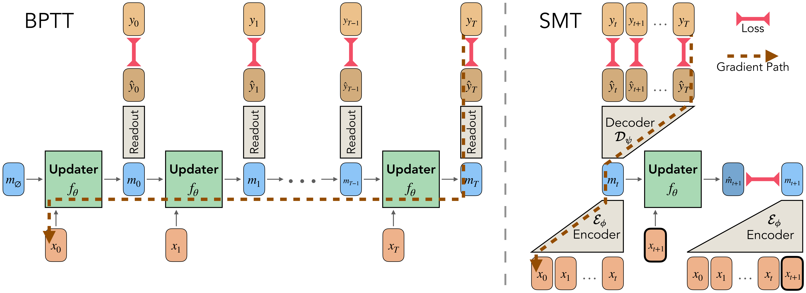

<h1 align="center">
  <a href="https://akarshkumar.com/smt/">
    </a><br>
</h1>


<h1 align="center">
Pretraining Recurrent Networks without Recurrence
</h1>
<p align="center">
  🌐 <a href="https://akarshkumar.com/smt/">Project Page</a> |
  📄 <a href="https://arxiv.org/abs/2606.06479">arXiv</a>
</p>
<p align="center">
<!-- <a href="https://colab.research.google.com/github/akarshkumar0101/smt/blob/master/tutorial.ipynb" target="_parent"></a> -->
</p>

[Akarsh Kumar](https://akarshkumar.com/), [Phillip Isola](https://web.mit.edu/phillipi/)
<br>
MIT

## Abstract
Training recurrent neural networks (RNNs) requires assigning credit across long sequences of computations.
Standard backpropagation through time (BPTT) addresses this problem poorly:
it is sequential in time, limiting parallelism, and suffers from vanishing or exploding gradients, making long-range associations difficult to learn.
We propose *Supervised Memory Training* (SMT), a method for training nonlinear RNNs that sidesteps recurrent credit propagation entirely by reducing RNN training to supervised learning on one-step memory transition labels $(m_t, x_{t+1}) \rightarrow m_{t+1}$.
SMT acquires these memory labels by training a Transformer-based encoder on a predictive state objective--retaining only information from the past necessary to predict the future.
By decoupling *what to remember* from *how to update memory*, SMT enables time-parallel RNN training with a stable $\mathcal{O}(1)$ length gradient path between any two tokens--without ever unrolling the RNN.
We find that SMT outperforms BPTT when pretraining various RNN architectures on tasks like language modeling and pixel sequence modeling.
SMT enables nonlinear RNNs to better capture long-range dependencies and train in parallel, potentially unlocking the scaling of models that build temporal abstractions of past experience.


## Repo Description
This repo contains a minimal pytorch implementation of Supervised Memory Training (SMT) and DAgger Memory Training (DMT) for research purposes.
The code is simplified for ease of use and modification.

The RNN model in this repo uses a Transformer backbone, where the memory state is a list of memory tokens.

Important files:
- `src/model.py`: code for the encoder+decoder teacher and RNN models, SMT forward pass, DMT forward pass, and inference/generation.
- `src/train_smt.py`: code to train teacher+RNN with SMT.
- `src/train_dmt.py`: code to train teacher+RNN with DMT.
- `main.ipynb`: a notebook walking you through the code.
- `tutorial.ipynb`: a notebook walking you through the basics of SMT 

Dataset files:
- `src/my_datasets/mnist.py`: code for gathering MNIST data.
- `src/my_datasets/tinystories.py`: code for gathering TinyStories data.
- `src/my_datasets/__init__.py`: code for loading dataset and sampling batches.

## Installation
You can setup the environment for this project with either docker, conda, or pip.

If you use docker, we provide a Dockerfile in this repo.

For conda or pip, install your favorite version of python and pytorch, then install these libraries:
\
`pip install numpy pandas xarray matplotlib tqdm einops einop tyro jupyterlab ipywidgets x_transformers huggingface_hub transformers datasets`.
\
The exact versions of these libraries we tested are in `requirements.txt`.


## Running
Do `cd src` and stay in that working directory.

### Data
To download the MNIST and TinyStories datasets and set them up for this repo, run:
`python my_datasets/mnist.py` and `python my_datasets/tinystories.py`.
\
This will create files like `src/data/mnist/train.npy` that contains the entire training data as one long token sequence array.

`my_datasets/__init__.py` contains code to load the dataset and sample from it:
```python
from my_datasets import get_dataset
tokenizer, ds_train, ds_test = get_dataset("mnist")
batch = ds_train.sample_batch(32, 28*28*2)
x = batch['x']
imgs = tokenizer.decode(x.cpu().numpy())
```
The dataset code is simple and it should be very straightforward to add your own custom datasets.

### Run SMT and DMT

`main.ipynb` walks you through how to
- set up the run configs
- launch SMT and DMT runs
- analyze the resulting RNN

If you are looking for a one liner command, here you go:

For SMT on MNIST:
```python
python train_smt.py --seed=0 --dataset="mnist"       --n_iters=150000 --log_every=1000 --ckpt_every=None --save_dir="./runs/smt_mnist_0/"       --load_rnn_path=None --load_teacher_path=None --rnn.vocab_size=256 --rnn.mem_size=4096 --rnn.mem_tokens=16 --rnn.mem_rms_norm=True --rnn.mem_fsq=None --rnn.d_model=256 --rnn.rnn_depth=8 --rnn.decoder_depth=4 --rnn.n_heads=8 --rnn.rotary_pos_emb=True --rnn.use_rmsnorm=True --teacher.vocab_size=256 --teacher.mem_size=4096 --teacher.mem_tokens=16 --teacher.mem_rms_norm=True --teacher.mem_fsq=None --teacher.d_model=256 --teacher.encoder_depth=8 --teacher.decoder_depth=4 --teacher.n_heads=8 --teacher.rotary_pos_emb=True --teacher.use_rmsnorm=True --lr=0.0003 --lr_schedule="warmup_constant" --weight_decay=0.01 --adam_betas 0.9 0.95 --batch_size=128 --grad_accum_steps=1 --clip_grad_norm=1.0 --smt.T=320 --smt.Tc=256 --smt.Tf=64 --smt.gamma=1.0 --smt.coef_dec=1.0 --smt.coef_dyn=0.1 --smt.coef_unif=0.001 --smt.unif_over_tokens=True --smt.detach_rnn=False --smt.hot_rnn=True --smt.hot_teacher=True 
```

For SMT on TinyStories:
```python
python train_smt.py --seed=0 --dataset="tinystories" --n_iters=150000 --log_every=1000 --ckpt_every=None --save_dir="./runs/smt_tinystories_0/" --load_rnn_path=None --load_teacher_path=None --rnn.vocab_size=256 --rnn.mem_size=4096 --rnn.mem_tokens=16 --rnn.mem_rms_norm=True --rnn.mem_fsq=None --rnn.d_model=256 --rnn.rnn_depth=8 --rnn.decoder_depth=4 --rnn.n_heads=8 --rnn.rotary_pos_emb=True --rnn.use_rmsnorm=True --teacher.vocab_size=256 --teacher.mem_size=4096 --teacher.mem_tokens=16 --teacher.mem_rms_norm=True --teacher.mem_fsq=None --teacher.d_model=256 --teacher.encoder_depth=8 --teacher.decoder_depth=4 --teacher.n_heads=8 --teacher.rotary_pos_emb=True --teacher.use_rmsnorm=True --lr=0.0003 --lr_schedule="warmup_constant" --weight_decay=0.01 --adam_betas 0.9 0.95 --batch_size=128 --grad_accum_steps=1 --clip_grad_norm=1.0 --smt.T=320 --smt.Tc=256 --smt.Tf=64 --smt.gamma=1.0 --smt.coef_dec=1.0 --smt.coef_dyn=0.1 --smt.coef_unif=0.001 --smt.unif_over_tokens=True --smt.detach_rnn=False --smt.hot_rnn=True --smt.hot_teacher=True 
```

For DMT on MNIST:
```python
python train_dmt.py --seed=0 --dataset="mnist"       --n_iters=1500 --log_every=10 --ckpt_every=300 --save_dir="./runs/smt_mnist_0//ft_dmt_256"       --load_rnn_path="./runs/smt_mnist_0//rnn.pkl"       --load_teacher_path="./runs/smt_mnist_0//teacher.pkl"       --rnn.vocab_size=256 --rnn.mem_size=4096 --rnn.mem_tokens=16 --rnn.mem_rms_norm=True --rnn.mem_fsq=None --rnn.d_model=256 --rnn.rnn_depth=8 --rnn.decoder_depth=4 --rnn.n_heads=8 --rnn.rotary_pos_emb=True --rnn.use_rmsnorm=True --teacher.vocab_size=256 --teacher.mem_size=4096 --teacher.mem_tokens=16 --teacher.mem_rms_norm=True --teacher.mem_fsq=None --teacher.d_model=256 --teacher.encoder_depth=8 --teacher.decoder_depth=4 --teacher.n_heads=8 --teacher.rotary_pos_emb=True --teacher.use_rmsnorm=True --lr=3e-05 --lr_schedule="warmup_cosine" --weight_decay=0.01 --adam_betas 0.9 0.95 --batch_size=32 --clip_grad_norm=1.0 --dmt.T=576 --dmt.Td=256 --dmt.Tc=256 --dmt.Tf=64 --dmt.k=16 --dmt.coef_dec=1.0 --dmt.coef_dyn=10.0 --dmt.coef_unif=0.01 --dmt.coef_readout=1.0 --dmt.detach_readout=True --dmt.detach_rnn=False --dmt.hot_rnn=True --dmt.hot_teacher_encoder=False --dmt.hot_teacher_decoder=False 
```

For DMT on TinyStories:
```python
python train_dmt.py --seed=0 --dataset="tinystories" --n_iters=1500 --log_every=10 --ckpt_every=300 --save_dir="./runs/smt_tinystories_0//ft_dmt_256" --load_rnn_path="./runs/smt_tinystories_0//rnn.pkl" --load_teacher_path="./runs/smt_tinystories_0//teacher.pkl" --rnn.vocab_size=256 --rnn.mem_size=4096 --rnn.mem_tokens=16 --rnn.mem_rms_norm=True --rnn.mem_fsq=None --rnn.d_model=256 --rnn.rnn_depth=8 --rnn.decoder_depth=4 --rnn.n_heads=8 --rnn.rotary_pos_emb=True --rnn.use_rmsnorm=True --teacher.vocab_size=256 --teacher.mem_size=4096 --teacher.mem_tokens=16 --teacher.mem_rms_norm=True --teacher.mem_fsq=None --teacher.d_model=256 --teacher.encoder_depth=8 --teacher.decoder_depth=4 --teacher.n_heads=8 --teacher.rotary_pos_emb=True --teacher.use_rmsnorm=True --lr=3e-05 --lr_schedule="warmup_cosine" --weight_decay=0.01 --adam_betas 0.9 0.95 --batch_size=32 --clip_grad_norm=1.0 --dmt.T=576 --dmt.Td=256 --dmt.Tc=256 --dmt.Tf=64 --dmt.k=16 --dmt.coef_dec=1.0 --dmt.coef_dyn=10.0 --dmt.coef_unif=0.01 --dmt.coef_readout=1.0 --dmt.detach_readout=True --dmt.detach_rnn=False --dmt.hot_rnn=True --dmt.hot_teacher_encoder=False --dmt.hot_teacher_decoder=False 
```


## Bibtex Citation
```
@article{kumar2026smt,
  title     = {Pretraining Recurrent Networks without Recurrence},
  author    = {Akarsh Kumar and Phillip Isola},
  year      = {2026},
  url       = {https://arxiv.org/abs/2606.06479},
  note      = {Project page: \url{https://akarshkumar.com/smt}},
}
```